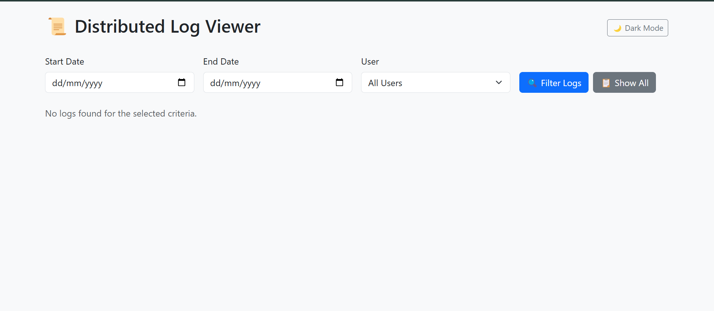
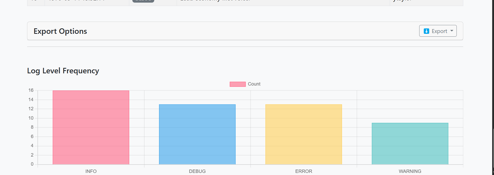

# 📜 Distributed Log Viewer

A lightweight, Flask-based log viewing dashboard for parsing, visualizing, and managing log files from distributed systems. Built for developers, analysts, and sysadmins who need a user-friendly interface to inspect and filter logs without complex tooling.
 Landing page
 chart page


## 🚀 Features

- 🔍 Filter logs by date and user
- 📈 Visualize log level frequency using charts
- 🌙 Dark mode toggle
- 📁 Upload & parse CSV log files--still work in progress
- 📊 Paginated & searchable table view
- ⬇️ Export logs in CSV, JSON, or TXT
- 🪵 Designed with Bootstrap 5 for responsiveness

---

## 📦 Getting Started

### 1. Clone the repo

```bash
git clone https://github.com/brianmurunga/distributed_log_processor.git
cd distributed-log-viewer


## 📁 Project Structure

```
cli.py
database.py
export_logs.py
log_generator.py
query_logs.py
visualize_logs.py
requirements.txt
README.md
```

## 🔧 Setup

```bash
python -m venv venv
source venv/bin/activate  # Windows: venv\Scripts\activate
pip install -r requirements.txt
```

## 🧪 Usage

```bash
python log_generator.py
python cli.py query --start 2024-03-25 --end 2024-03-30
python cli.py export --start 2024-03-25 --end 2024-03-30 --filename logs.csv
python cli.py delete --days 10
```

## 📊 Visualize Logs

```python
from query_logs import query_logs
from visualize_logs import plot_log_levels

logs = query_logs("2024-03-01 00:00:00", "2024-03-31 23:59:59")
plot_log_levels(logs)
```